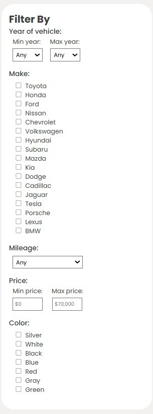

# Used Car Sales Website

This website displays used cars for sale at a dealership based on the filters selected by the user. This project was created with:
- JS
- HTML
- CSS

The home page shows all the used cars that are currently available.

<video src="home-page.mp4" width="80%" controls></video>

---
The user can select different filter options such as min and max year, make, mileage, min and max price, and color of vehicle, and see the results in real-time. The user may choose to leave one or more filter-by options as the default. The user may select multiple different make options and color options.

---
This is an example of the results page when different filter-by options are selected.

